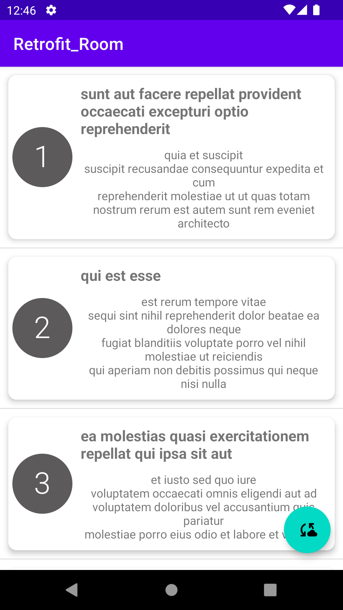
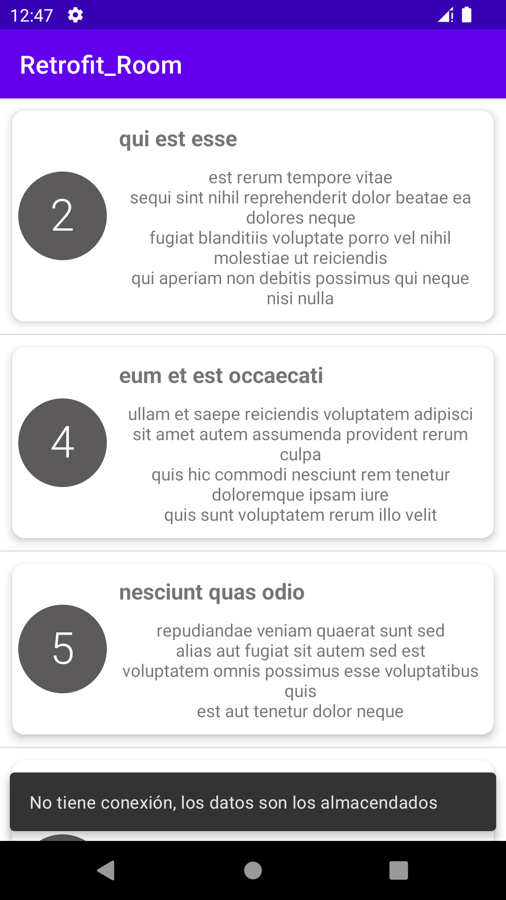

Uso de la librería Retrofit y Room

{width="1.5021041119860017in"
height="2.6704068241469816in"}
{width="1.5371489501312336in"
height="2.732709973753281in"}

La apk Retrofit_Room esta desarrollada para mostrar el uso de estas dos
librerías. Además, también se implementan la solicitud de premisos y la
detección de conexión a internet (forma muy básica).

**Retrofit:**

Se implemento el consumo de un webservice
(<https://jsonplaceholder.typicode.com/posts>), el método que se usa es
GET.

**Room:**

Se implemento tres operaciones de base datos:

-   Insertar datos.

-   Obtener los datos almacenados.

-   Borrar los datos almacenados.
